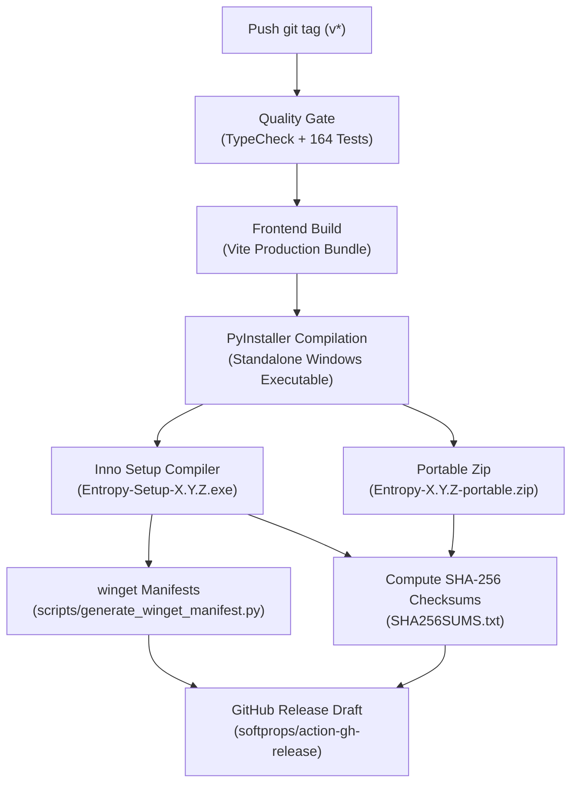

# Distribution, Packaging & Code-Signing Reference

This document outlines Entropy's release pipeline, Windows package distribution (`winget`), dual-release artifact generation, and code-signing strategy.

---

## 🚀 Release Lifecycle Overview

Entropy releases are fully automated via GitHub Actions (`.github/workflows/ci.yml`).



---

## 📦 Windows Package Manager (`winget`)

### 1. Manifest Structure
Entropy packages follow Microsoft's `winget-pkgs` schema (v1.6.0):
- **Version Manifest**: `dist/winget/manifests/w/WassimAbdelli/Entropy/<version>/WassimAbdelli.Entropy.yaml`
- **Installer Manifest**: `dist/winget/manifests/w/WassimAbdelli/Entropy/<version>/WassimAbdelli.Entropy.installer.yaml`
- **Locale Manifest**: `dist/winget/manifests/w/WassimAbdelli/Entropy/<version>/WassimAbdelli.Entropy.locale.en-US.yaml`

### 2. Manifest Automation Script
Use the built-in generator:
```powershell
# Automatically reads version from scan.py and computes SHA-256 from dist/
python scripts/generate_winget_manifest.py

# Or specify custom installer path:
python scripts/generate_winget_manifest.py --installer dist/Entropy-Setup-0.2.6.exe
```

### 3. Submitting to `microsoft/winget-pkgs`
1. Fork [microsoft/winget-pkgs](https://github.com/microsoft/winget-pkgs).
2. Copy `dist/winget/manifests/w/WassimAbdelli/Entropy/<version>/` into `manifests/w/WassimAbdelli/Entropy/<version>/`.
3. Validate locally:
   ```powershell
   winget validate --manifest manifests/w/WassimAbdelli/Entropy/<version>/
   ```
4. Open a pull request against `microsoft/winget-pkgs` with branch name `wassimabdelli-entropy-<version>`.

---

## 🔐 Open-Source Code Signing (SignPath.io)

### Why SignPath?
Windows SmartScreen displays an "Unknown Publisher" warning on unsigned executables. The [SignPath Foundation](https://about.signpath.io/open-source) provides free code-signing certificates for open-source GitHub projects.

### Setup Steps:
1. Apply for an open-source project account at [signpath.io](https://about.signpath.io/open-source).
2. Configure SignPath GitHub Action in `.github/workflows/ci.yml`:
   ```yaml
   - name: Sign Inno Setup Installer
     uses: signpath/github-action-submit-signing-request@v1
     with:
       api-token: ${{ secrets.SIGNPATH_API_TOKEN }}
       organization-id: ${{ secrets.SIGNPATH_ORG_ID }}
       project-slug: 'entropy'
       signing-policy-slug: 'release-signing'
       artifact-path: 'dist/Entropy-Setup-${{ env.VERSION }}.exe'
   ```
3. Once approved, releases receive an Authenticode signature from a trusted Microsoft CA, completely eliminating SmartScreen warnings.

---

## 🛡️ File Integrity Verification

Users and administrators can verify binary integrity directly from PowerShell without third-party utilities:
```powershell
certutil -hashfile Entropy-Setup-0.2.6.exe SHA256
```
Compare the output string with `SHA256SUMS.txt` published with every release.
